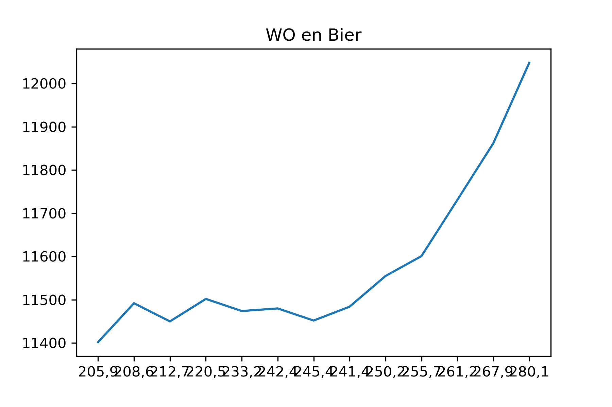

Fantastic yeasts and where to find them: the hidden diversity of dimorphic fungal pathogens
An analysis of the forces required to drag sheep over various surfaces
The neurocognitive effects of alcohol on adolescents and college students

in de plot is te zien hoe het aantal WO studenten in verhouding staat met de hoeveelheid bier die ze drinken
